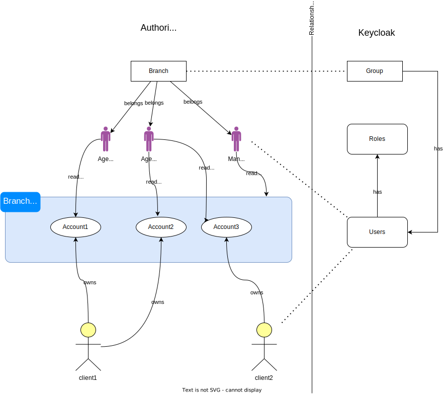
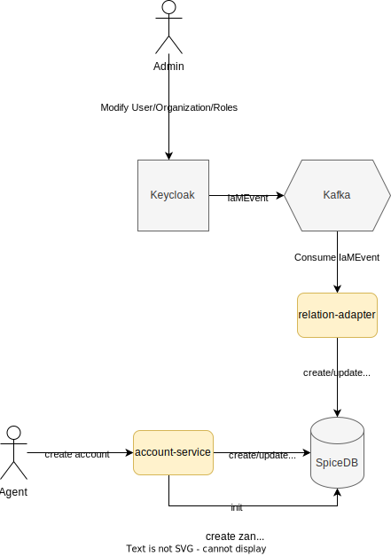
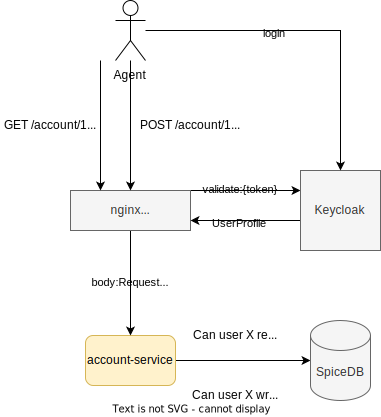

# Purpose

Sample demonstration of using centralized fine grained authorization along with IAM in a distributed solution

# Use case

We will demonstrate basic Banking account operations

* Create account
* See account information

conceptually following diagram illustrates roles and actions along with IAM mapping <br>



# Data flows

## Provisioning
Following diagram illustrates the provisioning of the authorization services with other part of the solution <br>



## Auth and Authorization Flow
This is end 2 end flow when actor fires a request towards the system and how the request firstly authenticated in gateway then authorized from the service <br>



# Components

1. **account-service**: this is the microservice responsible of handling banking account business capabilities. It is written in `Golang`
2. **keycloak-relation-adapter**: this is the adapter to do the mapping in-between `Keycloak` and `SpiceDB`. It is written in `Jdk 20` and `Spring boot 3.1`
3. **SpiceDB**: Centralized authorization service inspired by `Google Zanzibar`. [SpiceDB]([https://](https://github.com/authzed/spicedb))
4. **Keycloak**: Open source IAM application [Keycloak]([https://github.com/keycloak/keycloak])
5. **Kafka**: Message broker to relay the change events from Keycloak to the adapter
6. **Nginx**: Nginx is used to handle the ingress traffic and integrating with keycloak to do the autentication. Then it will forward the user profile downstream


# HOWTO

* Onboard schema to spicedb
```bash
zed context set first-dev-context :50051 "demo-key" --insecure
zed schema write spicedb-schema.zed --insecure
```

<TODO: explain how to test use cases with keycloak screenshots>

# TODO

- [ ] Nginx integration
- [ ] K8s deployment with sidecar pattern
